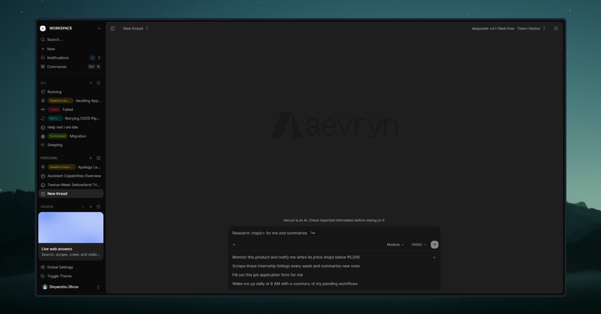
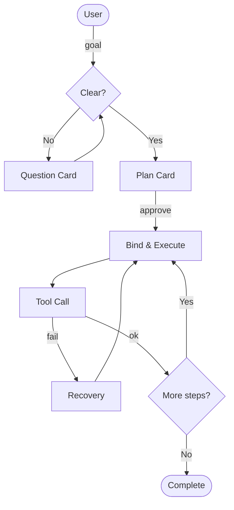
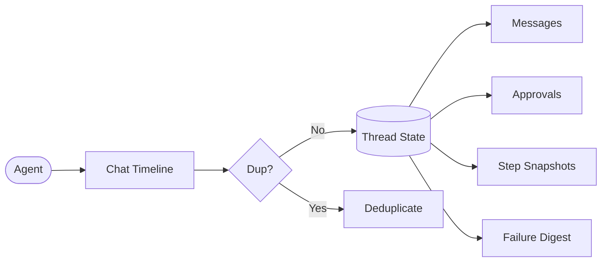

---

A private agentic AI workspace that <code>executes</code> instead of just <code>chatting</code> - give it a <code>goal</code>, answer its questions, approve its plan, and watch it work step-by-step in real time.

 

> [!IMPORTANT]\
> **This is a personal, private project.** Not published, not a framework, and not open for use by others. It is under active development; behavior and code may change without notice.

## Table of Contents

- [Features](#features)
- [Tech Stack](#tech-stack)
- [How It Works](#how-it-works)
- [Project Structure](#project-structure)
- [Design Notes](#design-notes)
- [Roadmap](#roadmap)
- [License](#license)

## Features

- **`🎯 Goal-driven loop`** - `clarify` --> `plan` --> `approve` --> `execute` --> `report`, not open-ended chat
- **`📋 Question cards`** - the agent asks for missing details with structured interactive cards
- **`📑 Plan cards`** - a step-by-step plan is presented and only runs after you approve
- **`⚡ Chat vs Run mode`** - cheap `conversational` turns for quick questions, full `approved runs` for real work
- **`🔁 Re-runnable workflows`** - bound plans `re-run` anytime
- **`⌨️ BYOK providers`** - bring your own key for any `OpenAI-compatible` provider (Groq, OpenAI, OpenRouter…)
- **`🛡️ Tool safety`** - SSRF guard on `web` tooling, `prompt-injection` defense, `replay` protection, `tool-call` limits
- **`🔒 Ownership everywhere`** - every thread/workflow read-write is `user-scoped`; cross-user access yields `404`
- **`💾 Durable state`** - every turn lands in the DB exactly `once`; retries, reconnects and tab refreshes never duplicate content

## Tech Stack

| Layer        | Tech                                    |
| ------------ | --------------------------------------- |
| `Framework`  | Next.js (App Router) + React 19         |
| `Monorepo`   | Turborepo + Bun workspaces              |
| `Agent loop` | AI SDK v7 (`ToolLoopAgent`)             |
| `Database`   | PostgreSQL (`Supabase`) + `Drizzle ORM` |
| `Realtime`   | Supabase Realtime (postgres_changes)    |
| `Auth`       | Supabase Auth (`SSR` + browser clients) |
| `Styling `   | TailwindCSS v4 + shadcn/ui primitives   |
| `Quality`    | Biome, `Vitest`, TypeScript strict      |
| `Web Agent`  | Anakin                                  |

## How It Works

 

_Security runs through every request: `authenticated` and `owns-the-thread` checks gate access, web tooling is `SSRF-guarded`, untrusted content is `screened` for `prompt injection`, and every turn is `deduplicated` so state lands exactly once._

## Project Structure

- **`apps/web`** - the `Next.js` app: routes, `api`, hooks, chat ui
- **`packages/agent`** - the agent loop: `tools`, `ssrf-guard`, `loop-control`, tool-call repair
- **`packages/workflow`** - services: threads, turns, approvals, `dedupe`, workspaces
- **`packages/db`** - `Drizzle` schema, migrations, row-level crypto
- **`packages/ui`** - the design system: `chat-composer`, `question-flow`, plan cards, command menu
- **`packages/auth`** - `Supabase` auth (`SSR` + browser clients)
- **`packages/env`** / **`config`** - env validation and shared types

## Design Notes

- **`🎯 One loop, one contract`** - every turn is `clarify -> plan -> execute`; the model never free-runs
- **`🧱 Persistence before display`** - the DB row is the source of truth; the ui renders what landed, never what streamed
- **`🛡️ Assume hostile input`** - tool results and web content are `untrusted` by default and screened before they reach the model
- **`♻️ Idempotent by design`** - approvals, dedupe and step snapshots make every side effect `replay-safe`

## Roadmap

- **`🚧 now`** - hardening the loop: memory, workflow re-runs, retry visibility
- **`🔭 next`** - scheduled workflows, prompt presets, provider health checks

## License

Private project - all rights reserved.

`If you found this repo by accident, feel free to look around`
